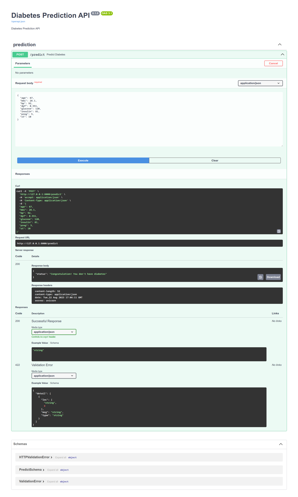

# diabetes_prediction

## Create Virtual Environment:
>>> python -m venv venv

## Activate Virtual Env
>>> source venv/bin/activate (Linux/Mac)
>>> venv\Scripts\activate (Windows)

## Install Dependencies
>>> pip install -r requirements.txt

## generate prediction Model
>>> python app/predict.py (in terminal)

## Run the project
>>> uvicorn app.main:app --reload

